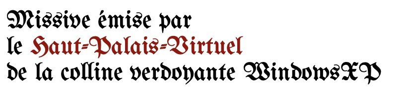
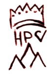

**Oyez, Oyez,** 
Brave gens, 
jeune inexpérimenté·e 
ouvre bien les oreilles, 
désembrume-toi la vue, 
chauffe tes neurones.

Nous Ancêtre du Haut-Palais,  
référants de la connaissance arcanique du virtuel, 
nous avons besoin de renouveler nos rangs,  
nous engageons des jeunes, de fières apprentits. 

Pour tester ta bravoure,
nous publions une liste de Hauts-Faits, 
une liste de tâches cyclopéenne  
qu'il te faudra achevée pour prétendre accéder au salon des titrès. 

Toi, qui affronteras ces Haut-faits,  
tu auras besoin d'un entraînement quotidien,  
d'une débrouillardise en cours d'affûtage, 
de coopération (...aucun héros ne s'est construit seul)  
et d'une passion florissante pour le *Haut-Palais-Virtuel*. 

En réconpense, nous Ancêtres du *Haut-Palais-Virtuel* offirons 
à celles et ceux qui abatrons l'entièreté de cette suite de quêtes 
des titres de noblesses tel que :   
**Portes-étendards, Peintres-Héraldique, Magistères-Archivistes, Mages-Arcanistes**

Afin d'écrire ton nom sur la longue liste  
des prétendant·e·s Novices du *Haut-Palais-Virtuel* 
il te faudra avant tout réaliser 
la tâche numéro zéro :

****
> Rendez-vous sur le site web [openprocessing.org](https://openprocessing.org) 
> crée un compte. En suite Follow notre **[Secrétaire-Perpétuel](https://openprocessing.org/@AncetreSecretairePerpetuel)**.

****

Un Titre du *Haut-Palais-Virtuel* te sera attribué  
au moment de ta victoire contre les 10 épreuves suivantes.  
Prend soin de ton parcours, ton Titre sera choisi par  
notre **Nommateur-Omnilinguiste** en fonction de l'orientation esthétique  
que tu auras prise durant tout ton parcours. 

****

> Écris un script d'invocation en javascript  
> qui te permettra d'invoquer à l'écran l'image de ton avatar digital.

****
> En l'hommage de feu **Ômagnifique-Grand-Architecte Dédale**,  
> réalise le plan d'un labyrinthe   
> au moyen des seuls caractères typographique "/" & "\\".

****
> Crée une composition picturale faisant apparaitre 1 MegaCercle 
> 1024 cercles => 1 kiloCercle  
> 1024 kiloCercles => 1 MegaCercle.

****
> Crée un essaim de mouchettes volant autour de ton curseur de souris.

****
> Pour démontrer tes compétance en magie,   
> crée un espace interactif dans lequel   
> tu feras apparaitre une boule de feu   
> à chaque click de souris.

****
> Produit une image animée susceptible d'hypnotiser ses spectateurs.

****
> En hommage à **Ômagnifique-Pionnier-Digital John Maeda**,  
> réalise une composition graphique représentant le temps qui passe,  
> ta propre horloge.

****
> Crée un composition picturale sensible au cycle jour/nuit.  
> Cette production unique doit abritée une scène cachée  
> ne se révélant que la nuit venue prenant la place de la scène de jour. 

****
> Produit une composition d'iFrame (fenêtre sur le web) un polyptyque du web.

****
> Les images numériques sont composées de pixels  
> codés avec 256 valeurs pour chaque couche de couleur  
> rouge, vert, bleu soit 256 * 256 * 256 couleurs.  
> Crée une composition picturale faisant apparaître  
> l'entièreté du spectre colorimétrique de nos écran,  
> un pixel par couleur.

****
 
Valide la réalisation de chaque épreuve en publiant  
sur Discord dans l'anti-chambre-des-novice le lien de ton travail,  
annonce toi en invoquant notre **@Secrétaire-Perpétuel**. 
Il te contactera pour évaluer ta progression. 
Lorsque tu auras vaincu les 10 tâches,  
notre **Nommateur-Omnilinguiste** déclanchera  
la cérémonie d'adoubement te permettant de recevoir  
ton Titre de noblesse du *Haut-Palais-Virtuel*,  
tu accèderas aussi au prestigieux salon-des-titrès.

Tu disposes d'une durée indéfinie  
pour la réalisation des ces épreuves. 
Néanmoins, le tic-tac du chrono est animé par tes pairs,  
car **il s'agit d'une course**. 
Chaque membre Titré du *Haut-Palais-Virtuel*  
peut accéder aux 3 Très-Hauts-Faits que voici : 

****
> Réalise une extension de navigateur web rigolotte.

****
> Réalise une application qui capture 
> les 100x100 pixels entourant le curseur 
> de ta souris à chaque fois que tu click. 

****
> Crée une police d'écriture (une fonte) 
> faite de caractères typographiques abstraits. 

****

La réalisation de ces 3 Très-Hauts-Faits t'attribuera le préfix  **Ômagnifique** devant ton titre de noblesse   
et clôturera pour tous les prétendants  
la possibilité de recevoir un Titre du *Haut-Palais-Virtuel*   
par l'accomplissement de cette suite de quêtes.

